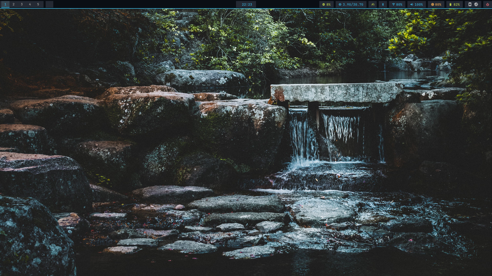
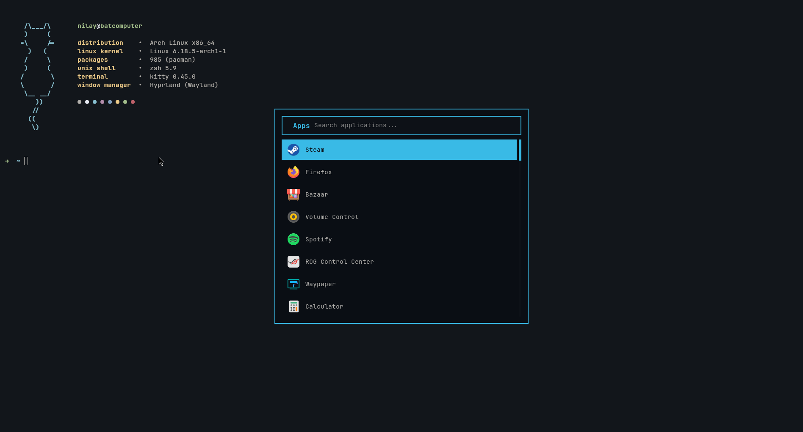
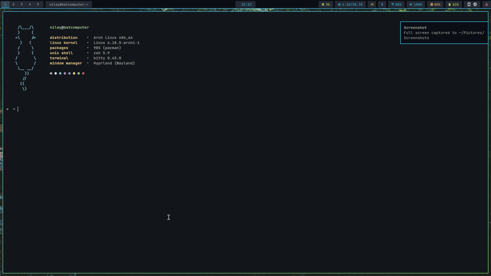
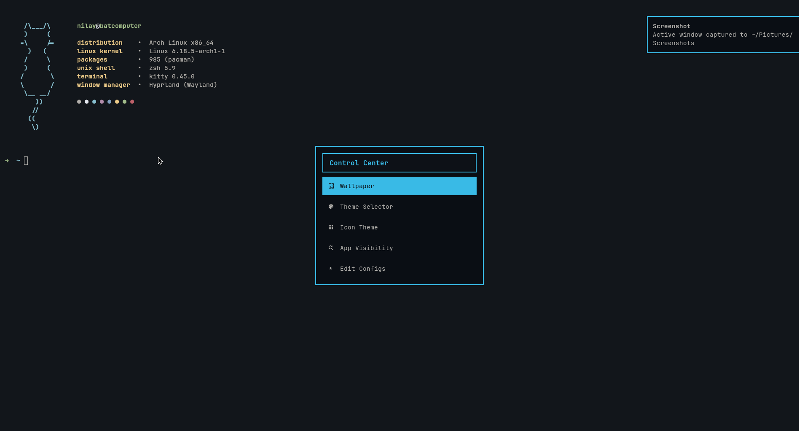

# Arch Linux + Hyprland Dotfiles
My Personal Configuration for Arch Linux using the Hyprland compositor.
---

##  Gallery





---

##  Components

| Component | Application |
|-----------|-------------|
| **OS** | Arch Linux |
| **Compositor** | [Hyprland](https://hyprland.org) |
| **Terminal** | [Kitty](https://sw.kovidgoyal.net/kitty/) |
| **Shell** | Zsh |
| **Bar** | [Waybar](https://github.com/Alexays/Waybar) |
| **Launcher** | [Rofi](https://github.com/davatorium/rofi) |
| **Notifications** | [Dunst](https://dunst-project.org/) |
| **Lock Screen** | Hyprlock |
| **Idle Daemon** | Hypridle |
| **Wallpaper** | swww / Waypaper |
| **File Manager** | Nautilus |

---

##  Installation

### 1. Clone the Repository
```bash
git clone https://github.com/yourusername/dotfiles-arch.git
cd dotfiles-arch
```

### 2. Install Packages
You can reference the `package_list.txt` for all necessary packages.
```bash
# Using pacman (requires root/sudo)
sudo pacman -S --needed - < package_list.txt

# Or if you use an AUR helper like yay
yay -S --needed - < package_list.txt
```

### 3. Apply Configurations
Copy the configuration folders to your local `.config` directory. **Backup your existing configs first!**

```bash
# Example backup
mkdir ~/config_backup
mv ~/.config/hypr ~/config_backup/
mv ~/.config/waybar ~/config_backup/
# ... repeat for others

# Copy new configs
cp -r hypr ~/.config/
cp -r waybar ~/.config/
cp -r kitty ~/.config/
cp -r rofi ~/.config/
cp -r dunst ~/.config/
cp -r fastfetch ~/.config/

# Copy .zshrc to home
cp .zshrc ~/.zshrc
```

---

## Keybindings
Most keybindings use `SUPER` (Windows Key) as the main modifier. See `hypr/keybinds.conf` for the full list.

| Key | Action |
|-----|--------|
| `SUPER` + `Return` / `T` | Open Terminal (Kitty) |
| `SUPER` + `Space` | App Launcher (Rofi) |
| `SUPER` + `E` | File Manager (Nautilus) |
| `SUPER` + `B` | Open Browser |
| `SUPER` + `Q` | Close Active Window |
| `SUPER` + `V` | Toggle Floating Window |
| `SUPER` + `F` | Toggle Fullscreen |
| `Print` | Screenshot Area |
| `SUPER` + `Print` | Screenshot Fullscreen |
| `SUPER` + `X` | Lock Screen |

---

## Directory Structure
- `hypr/`: Hyprland configuration (animations, monitors, rules, etc.).
- `waybar/`: Status bar configuration and style.
- `rofi/`: App launcher themes and scripts.
- `dunst/`: Notification daemon settings.
- `scripts/`: various utility scripts.

---
